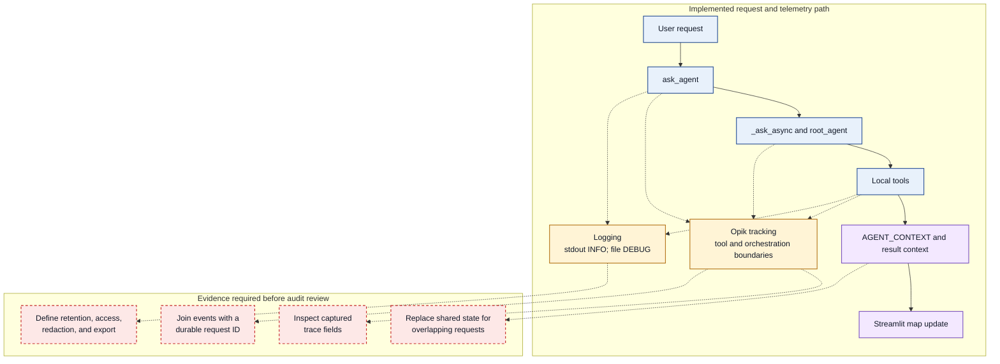

```mermaid
flowchart TB
    classDef flow fill:#E8F1FB,stroke:#2F5597,color:#111827,stroke-width:1.5px
    classDef state fill:#F3E8FF,stroke:#7E57C2,color:#111827,stroke-width:1.5px
    classDef telemetry fill:#FFF4D6,stroke:#B7791F,color:#111827,stroke-width:1.5px
    classDef gap fill:#FDE8E7,stroke:#C62828,color:#111827,stroke-width:1.5px,stroke-dasharray: 5 4

    subgraph A["Implemented request and telemetry path"]
        direction TB
        U[User request]:::flow
        A1[ask_agent]:::flow
        A2[_ask_async and root_agent]:::flow
        T[Local tools]:::flow
        S[AGENT_CONTEXT and result context]:::state
        UI[Streamlit map update]:::state

        U --> A1 --> A2 --> T --> S --> UI

        O[Opik tracking<br/>tool and orchestration boundaries]:::telemetry
        L[Logging<br/>stdout INFO; file DEBUG]:::telemetry

        A1 -.-> O
        A2 -.-> O
        T -.-> O
        A1 -.-> L
        T -.-> L
    end

    subgraph B["Evidence required before audit review"]
        direction LR
        G1[Inspect captured<br/>trace fields]:::gap
        G2[Join events with a<br/>durable request ID]:::gap
        G3[Define retention, access,<br/>redaction, and export]:::gap
        G4[Replace shared state for<br/>overlapping requests]:::gap
    end

    O -.-> G1
    O -.-> G2
    L -.-> G3
    S -.-> G4
```
